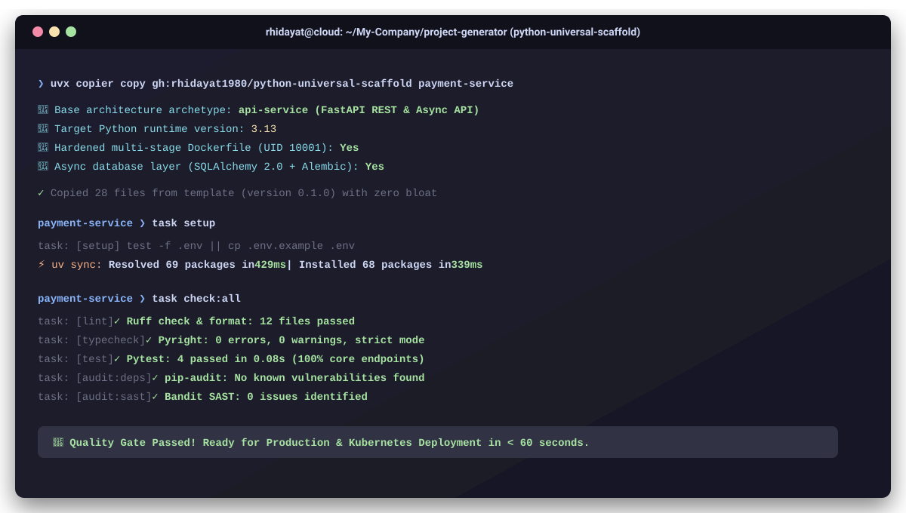

<!-- markdownlint-disable MD033 MD041 MD051 -->

<div align="center">

# 🚀 Python Universal Scaffold

**A Production-Grade, Multi-Archetype Python Project Generator**  
*Engineered for modern engineering teams using **Copier**, **mise**, **uv**, **Taskfile**, and **DevSecOps Hardening**.*

[](https://github.com/rhidayat1980/python-universal-scaffold/actions/workflows/template-ci.yml)
[](https://python.org)
[](https://astral.sh/uv)
[](https://mise.jdx.dev)
[](https://copier.readthedocs.io)
[](https://github.com/PyCQA/bandit)
[](LICENSE)

<br/>
<br/>



<p align="center">
  <a href="https://asciinema.org/a/0YZMB37CKc2pUCre" target="_blank">
    
  </a>
  <br/>
  <em>Click badge above to play interactive terminal recording via browser</em>
</p>

</div>

---

## 📑 Table of Contents

- [Assumptions & Starting Point](#assumptions--starting-point)
- [Prerequisites](#prerequisites)
- [Step-by-Step Guide (From Scratch to Running)](#step-by-step-guide-from-scratch-to-running)
- [The 6 Production Archetypes](#the-6-production-archetypes)
- [Developer Workflow & Commands](#developer-workflow--commands)
- [DevSecOps & Observability by Default](#devsecops--observability-by-default)
- [AI Agent Ready](#ai-agent-ready)
- [Keeping Projects Up-to-Date](#keeping-projects-up-to-date)
- [Contributing & Community](#-contributing--community)
- [Roadmap](#-roadmap)
- [License](#-license)

---

## 🎯 Assumptions & Starting Point

Before using this scaffold generator, understand the foundational design philosophy and target environment:

### 1. Key Assumptions

- **Modern Python Standards**: This scaffold supports **Python 3.10, 3.11, 3.12, or 3.13**, ensuring full backward compatibility for enterprise data/ML teams while supporting bleeding-edge Python 3.13 features.
- **Zero Host Pollution**: You should **never** install application packages globally or use standard `pip install`. Every project manages its own hermetic virtual environment (`.venv/`) via `uv`.
- **Reproducible Runtimes**: We assume tool versions (`uv`, `go-task`, `python`) should be locked per-project to guarantee that code runs identically on Linux, macOS, WSL2, and CI/CD pipelines.
- **Strict `src/` Layout**: All source code is placed inside `src/<package_name>/`. Flat layouts are avoided to prevent packaging ambiguities and import side-effects.

### 2. Starting Point

- **As an Individual Developer or Team**: You want to start a brand new Python service, pipeline, or library without wasting hours configuring linters, typecheckers, Dockerfiles, and CI pipelines.
- **You do NOT need a cloned template to use it**: You can generate projects directly from the GitHub repository using a single command (`uvx copier copy`).
- **You CAN update existing projects**: Because the scaffold is powered by Copier, you can update an existing project later when the template evolves by running `copier update`.

---

## 📋 Prerequisites

You only need **one** of the following tools installed on your system (Linux, macOS, or Windows WSL2):

### Option A: Using `uv` (Recommended - Zero Configuration)

If you have [Astral uv](https://docs.astral.sh/uv/) installed:

```bash
# Verify installation
uv --version
```

> `uv` includes `uvx`, which downloads and runs Copier in an ephemeral cache without installing anything globally!

### Option B: Using `mise` (Polyglot Tool Manager)

If your machine uses [mise-en-place](https://mise.jdx.dev/):

```bash
# Install uv, copier, and task via mise
mise use -g uv@latest copier@latest task@latest
```

*(Optional)* If you plan to build container images locally, ensure **Docker** or **Podman** is installed and running.

---

## 🚀 Step-by-Step Guide (From Scratch to Running)

Follow these steps to scaffold and run a production-ready application in under 2 minutes:

### Step 1: Run the Generator

Open your terminal in the directory where you want your new project folder to reside, then execute:

```bash
uvx copier copy gh:rhidayat1980/python-universal-scaffold my-new-service
```

*(Alternatively, if working with a local clone of this template repository: `copier copy /path/to/python-universal-scaffold my-new-service`)*

---

### Step 2: Answer the Interactive Prompts

> 💡 **Zero Prompt Boilerplate**: You don't need to specify `project_name` or `package_name`. Copier automatically infers `project_name` (e.g. `my-new-service`) and snake_case `package_name` (e.g. `my_new_service`) directly from your destination folder name!

The generator only prompts you for the architectural decisions:

| Prompt | Description | Default | Example Options |
| :--- | :--- | :--- | :--- |
| `project_archetype` | Architecture domain archetype | `api-service` | `api-service`, `data-analytics`, `ai-ml`, `pipeline-worker`, `cli-tool`, `library-package` |
| `python_version` | Target Python runtime | `3.12` | `3.10`, `3.11`, `3.12`, `3.13` |
| `include_container` | Include hardened multi-stage Dockerfile | `true` | `true`, `false` |
| `include_database` | Include async SQLAlchemy 2.0 + Alembic & PostgreSQL compose | `false` | `true`, `false` *(API / Worker only)* |
| `compute_target` | Hardware compute accelerator for AI/ML | `cpu` | `cpu`, `cuda-12` *(AI/ML only)* |
| `author_name` | Maintainer full name | `Engineering Team` | `Jane Doe` |
| `author_email` | Maintainer email address | `dev@company.local` | `jane@company.com` |

---

### Step 3: Enter and Trust the Environment

Navigate into your newly generated repository:

```bash
cd my-new-service

# If you use mise, trust the project-level tool configuration:
mise trust
```

---

### Step 4: Recommended Task Execution Workflow

Every generated project adheres to a strict, standardized execution workflow:

```text
┌──────────────┐     ┌──────────────┐     ┌──────────────┐     ┌──────────────┐
│  task setup  │ ──> │   task dev   │ ──> │   task fix   │ ──> │task check:all│
│(Init & Sync) │     │ (Development)│     │(Auto-format) │     │(Quality Gate)│
└──────────────┘     └──────────────┘     └──────────────┘     └──────────────┘
```

#### 1. Initialize Environment (One-time setup)

```bash
task setup
```

This task automatically:

1. Provisions a local `.env` configuration file from `.env.example`.
2. Creates an isolated virtual environment in `.venv/`.
3. Locks and installs all dependencies deterministically via `uv sync`.

#### 2. Run Local Workload (During Development)

Execute the primary task command corresponding to your chosen archetype:

```bash
# If api-service (FastAPI at http://localhost:8000)
task dev

# If data-analytics (JupyterLab exploration)
task notebook

# If ai-ml (Model training loop)
task train

# If pipeline-worker (Background queue consumer)
task worker

# If cli-tool (Terminal command)
task run -- --help

# If library-package (Build distribution wheel)
task build
```

#### 3. Format & Auto-Fix Code (Before Committing)

```bash
task fix
```

Automatically formats code, cleans up imports, and fixes autofixable linter issues with **Ruff**.

#### 4. Quality Gate & DevSecOps Verification (Required Before Push)

```bash
task check:all
```

Executes all 5 comprehensive quality and security gates simultaneously:

- ✅ Code formatting & linting (**Ruff**)
- ✅ Strict static type validation (**Pyright**)
- ✅ Unit & flow test coverage (**Pytest**)
- ✅ Dependency CVE vulnerability scan (**pip-audit**)
- ✅ SAST security code scan (**Bandit**)

---

## 📦 The 6 Production Archetypes

| Archetype | Description & Tech Stack | Core Files in `src/<pkg>/` | Primary Task Command |
| :--- | :--- | :--- | :--- |
| **`api-service`** | Production REST / Async Web API with **FastAPI**, **Uvicorn**, **Pydantic v2**, and optional async **SQLAlchemy 2.0 + Alembic**. | `main.py`, `api/routes.py`, `schemas/`, `db/session.py` | `task dev` |
| **`data-analytics`** | High-performance analytics & ETL engineering with **Polars**, **DuckDB**, **PyArrow**, and **JupyterLab**. | `pipelines/transform.py`, `queries/metrics.sql`, `notebooks/01_exploration.ipynb` | `task notebook`, `task run` |
| **`ai-ml`** | Deep learning and LLM fine-tuning pipelines using **PyTorch** (CPU / CUDA-12), **HuggingFace Hub**, and **NumPy 2.0**. | `training/train.py`, `inference.py`, `models/`, `datasets/` | `task train`, `task eval` |
| **`pipeline-worker`** | Resilient async background consumer with **Redis**, **Tenacity** exponential retries, and **Structlog**. | `worker.py`, `tasks.py` | `task worker` |
| **`cli-tool`** | Modern interactive terminal application powered by **Typer** and visual tables with **Rich**. | `cli.py` | `task run -- --help` |
| **`library-package`** | Zero-dependency reusable distribution package built with **Hatchling**, PEP 561 typing (`py.typed`), and custom exceptions. | `core.py`, `exceptions.py` | `task build` |

---

## 🛠 Developer Workflow & Commands

Every generated project includes a standardized `Taskfile.yml` so you never have to remember disparate CLI invocations:

```bash
task setup              # Initialize .env and synchronize dependencies into .venv
task services:up        # Spin up local development services (PostgreSQL / Redis) via Docker Compose
task services:logs      # Follow logs of local services
task services:down      # Stop and tear down local development services
task test               # Run Pytest test suite with terminal coverage report
task typecheck          # Validate static type safety with Pyright
task lint               # Check formatting and style rules with Ruff
task fix                # Auto-format and autofix lint issues
task audit:deps         # Scan third-party packages for known CVEs (pip-audit)
task audit:sast         # Static Application Security Testing (Bandit)
task check:all          # Run entire Quality Gate (Lint + Type + Test + Security)
task docker:build       # Build production multi-stage container image
task docker:run         # Run production container locally
```

---

## 📦 Managing Dependencies with `uv`

When your application requires additional third-party packages not included in the initial archetype:

### 1. Adding Production Runtime Dependencies

Use `uv add <package-name>`. This automatically updates `pyproject.toml`, refreshes `uv.lock`, and installs the package into `.venv/` in milliseconds:

```bash
# Add payment SDKs, HTTP clients, or specific tools
uv add httpx stripe

# Pin or specify version constraints
uv add "redis>=5.0.0" "celery[redis]>=5.4.0"
```

### 2. Adding Development / Testing Dependencies

Use the `--dev` flag to ensure development packages are never bundled into the production container:

```bash
# Add mock frameworks or test data generators
uv add --dev faker factory-boy freezegun
```

### 3. Removing Dependencies

```bash
uv remove stripe
```

### 4. Resyncing After Git Pulls

When pulling changes made by other team members:

```bash
task setup
# Or directly via uv:
uv sync
```

---

## 🛡 DevSecOps & Observability by Default

### 1. Hardened Docker Containers

- **Multi-Stage Build**: Builder stage leverages Astral uv caching (`--mount=type=cache,target=/root/.cache/uv`), reducing build times by up to 90%.
- **Non-Root Execution**: Runs under an unprivileged user `appuser` (`UID 10001:GID 10001`), preventing container breakout attacks.
- **Native Health Checks**: Includes an integrated `HEALTHCHECK` probing `/healthz` for Kubernetes, Docker Swarm, and GCP Cloud Run.

### 2. Structured JSON Logging

- Pre-configured using `structlog` in `src/<pkg>/core/logging.py`.
- Formats logs into standard JSON with ISO timestamps, log levels, contextual metadata, and traceback rendering, ready for Datadog, Grafana Loki, or Google Cloud Logging.

### 3. CI/CD GitHub Actions

- Pre-configured `.github/workflows/ci.yml` using `jdx/mise-action@v2`.
- Local developers and CI runners execute the exact same task: `task check:all`.

---

## 🤖 AI Agent Ready

This repository is tailored for autonomous AI programming assistants (**Antigravity IDE**, **Cursor**, **Windsurf**, **Claude Code**, **OpenHands**):

- **[`AGENTS.md`](./AGENTS.md)**: Clear behavioral rules, architecture boundaries, and Jinja template integrity instructions.
- **[`.agents/rules/python-standards.md`](./.agents/rules/python-standards.md)**: Coding standards for Python 3.12+, typing, and `pyproject.toml`.
- **[`.agents/skills/python-scaffold-expert/`](./.agents/skills/python-scaffold-expert/)**: Procedural guide for scaffolding, testing, and modifying templates.
- **[`.agents/skills/python-devsecops-audit/`](./.agents/skills/python-devsecops-audit/)**: Security scanning and container verification runbook.

---

## 🔄 Keeping Projects Up-to-Date

Because this scaffold is powered by Copier, you can seamlessly update existing projects with the latest template improvements, bugfixes, and security rules without losing any custom business logic.

> ⚠️ **Prerequisite for Template Updates**:
> Copier uses Git's **3-way merge engine** to safely update files without destroying your changes. Therefore, your generated project **must be a Git repository with an initial commit**:
> ```bash
> cd my-new-service
> git init
> git add .
> git commit -m "feat: initial commit from template"
> ```

### Option A: From Inside Your Generated Project

Once your project is committed, navigate into your project folder and run:

```bash
# Pull and apply latest template updates via Taskfile
task update:template

# Or using Copier CLI directly
copier update
```

### Option B: From Inside the Template Repository

If you maintain projects alongside this scaffold repository, leverage the built-in maintainer tasks:

```bash
# Check if a project has pending template updates
task check-update -- ../my-new-service

# Update target project to the latest template version
task update -- ../my-new-service

# Recopy all template files into target project
task recopy -- ../my-new-service
```

> **Note**: Copier computes an intelligent three-way Git diff, prompting you interactively only if there are conflict resolutions between template updates and your custom code.

---

## 🤝 Contributing & Community

Contributions are what make the open-source community an amazing place to learn, inspire, and create. Any contributions you make are **greatly appreciated**!

- 📖 **Contributing Guide**: Please review our [CONTRIBUTING.md](CONTRIBUTING.md) for local testing instructions and PR guidelines.
- 📜 **Code of Conduct**: We are committed to providing a welcoming and inspiring community. See [CODE_OF_CONDUCT.md](CODE_OF_CONDUCT.md).
- 🛡️ **Security Policy**: For responsible vulnerability disclosure, please refer to [SECURITY.md](SECURITY.md).
- 🐛 **Report a Bug**: Found a bug or template issue? Open a [Bug Report](https://github.com/rhidayat1980/python-universal-scaffold/issues/new?template=bug_report.yml).
- 💡 **Request a Feature**: Have an archetype or toolchain idea? Submit a [Feature Request](https://github.com/rhidayat1980/python-universal-scaffold/issues/new?template=feature_request.yml).

---

## 🗺️ Roadmap

Interested in upcoming archetype expansions (`llm-rag-agent`, `grpc-service`, `fullstack-web`, `event-stream-consumer`, `serverless-function`) and platform features? Check out our dedicated [Roadmap](ROADMAP.md).

---

## 📄 License

Distributed under the [MIT License](LICENSE). Free for open-source and commercial use.
