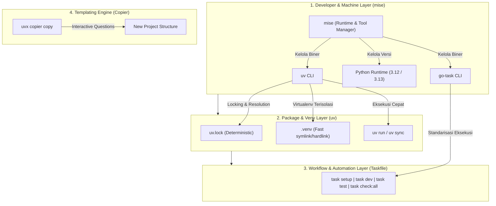

# 🚀 Python Universal Scaffold (`python-universal-scaffold`)

> **Production-Ready, Modular Python Project Generator** yang mengintegrasikan ekosistem tooling modern: **Copier**, **mise**, **uv**, **Taskfile**, dan **DevSecOps Hardening**.

Mendukung **6 Arketipe Industri Python** dengan zero host pollution, dependency locking instan, penegakan type safety, dan standarisasi developer experience lokal hingga CI/CD.

---

## 📑 Daftar Isi

- [🚀 Python Universal Scaffold (`python-universal-scaffold`)](#-python-universal-scaffold-python-universal-scaffold)
  - [📑 Daftar Isi](#-daftar-isi)
  - [🏛 Arsitektur \& Prinsip Desain](#-arsitektur--prinsip-desain)
    - [Prinsip Utama](#prinsip-utama)
  - [📦 6 Arketipe Proyek yang Didukung](#-6-arketipe-proyek-yang-didukung)
  - [📂 Struktur Repositori Scaffolding](#-struktur-repositori-scaffolding)
  - [⚡ Panduan Penggunaan Cepat (Quickstart)](#-panduan-penggunaan-cepat-quickstart)
    - [Prasyarat](#prasyarat)
    - [1. Generate Menggunakan Copier](#1-generate-menggunakan-copier)
    - [2. Inisialisasi \& Verifikasi Proyek Baru](#2-inisialisasi--verifikasi-proyek-baru)
  - [🛡 Matriks Fitur DevSecOps \& Observability](#-matriks-fitur-devsecops--observability)
  - [🛠 Daftar Perintah Taskfile](#-daftar-perintah-taskfile)
  - [🤖 Integrasi AI Agent](#-integrasi-ai-agent)
  - [📄 Lisensi](#-lisensi)

---

## 🏛 Arsitektur & Prinsip Desain

Arsitektur scaffolding ini membagi tanggung jawab secara deterministik dan terisolasi:



### Prinsip Utama

1. **Zero Host Pollution**: Host mesin lokal pengembang tidak pernah tercemar paket global. Semua dependensi terisolasi dalam `.venv/` lokal dengan locking kaku pada `uv.lock`.
2. **Single Tooling Config**: Konfigurasi linter (`ruff`), type checker (`pyright`), testing (`pytest`), dan dependency groups berada terpusat di `pyproject.toml`.
3. **Src Layout Pattern**: Menggunakan struktur `src/<package_name>/` untuk menghindari *import side-effect* yang sering terjadi pada layout flat konvensional.
4. **DevSecOps Native**: Multi-stage Dockerfile berjalan dengan **non-root user (UID 10001)**, pemindaian kerentanan paket pihak ketiga via `uv pip-audit`, dan SAST source code via `bandit`.

---

## 📦 6 Arketipe Proyek yang Didukung

| Arketipe | Fokus & Use Case | Core Dependencies | Command Utama |
| :--- | :--- | :--- | :--- |
| **`api-service`** | REST / Async API Backend berkinerja tinggi | FastAPI, Uvicorn, Pydantic v2, Pydantic-Settings *(Opsional: SQLAlchemy 2.0 asyncpg, Alembic)* | `task dev` |
| **`data-analytics`** | Riset data, eksplorasi analitik, dan pipeline ETL/ELT | Polars, DuckDB, PyArrow, JupyterLab, Altair | `task notebook`<br>`task run` |
| **`ai-ml`** | Training loop, inference model, dan LLM pipeline | PyTorch (CPU / CUDA-12), HuggingFace Hub, NumPy 2.0 | `task train`<br>`task eval` |
| **`pipeline-worker`** | Worker pemroses background task & antrean asinkron | Redis, Tenacity, Structlog, Pydantic-Settings | `task worker` |
| **`cli-tool`** | Aplikasi antarmuka baris perintah (CLI) terminal modern | Typer, Rich | `task run -- --help` |
| **`library-package`** | Library/paket reusable untuk distribusi PyPI / private repo | Hatchling build system, zero runtime overhead | `task build` |

---

## 📂 Struktur Repositori Scaffolding

```text
python-universal-scaffold/
├── copier.yml                                # Konfigurasi interaktif & validasi input Copier
├── README.md                                 # Dokumentasi utama proyek generator
├── AGENTS.md                                 # Petunjuk instruksi operasional untuk AI Agent
├── Agent.md                                  # Mirroring untuk kompabilitas multi-agent IDE
├── .agents/                                  # Antigravity/Agent Skills & Rules Root
│   ├── rules/
│   │   └── python-standards.md               # Konvensi coding, typing, dan arsitektur
│   └── skills/
│       ├── python-scaffold-expert/SKILL.md   # Runbook pembuatan & kustomisasi template
│       └── python-devsecops-audit/SKILL.md   # Runbook audit CVE, SAST, & container
├── .agent/                                   # Alias untuk tooling agent konvensional
└── template/                                 # Jinja2 Dynamic Project Blueprint
    ├── .github/workflows/ci.yml.jinja        # CI Pipeline deterministik (jdx/mise-action)
    ├── .dockerignore
    ├── .gitignore
    ├── .python-version
    ├── mise.toml.jinja                       # Tooling versions (uv, task, python)
    ├── Taskfile.yml.jinja                    # Task automation terpadu
    ├── pyproject.toml.jinja                  # Central dependency & tool configurations
    ├── .env.example.jinja                    # Environment template terisolasi
    ├── README.md.jinja                       # README dinamis untuk proyek yang digenerate
    ├── Dockerfile.jinja                      # Hardened non-root multi-stage container
    ├── data/                                 # Folder data (raw, interim, processed) [data-analytics]
    ├── notebooks/                            # Jupyter notebooks [data-analytics]
    ├── models/ & datasets/                   # Artifacts ML [ai-ml]
    ├── src/{{ package_name }}/
    │   ├── __init__.py
    │   ├── py.typed
    │   ├── core/
    │   │   ├── config.py                     # Pydantic BaseSettings
    │   │   └── logging.py                    # Production JSON structlog setup
    │   ├── api/ & schemas/ & db/             # Submodul arketipe api-service
    │   ├── pipelines/ & queries/             # Submodul arketipe data-analytics
    │   ├── inference.py & training/          # Submodul arketipe ai-ml
    │   ├── worker.py & tasks.py              # Submodul arketipe pipeline-worker
    │   ├── cli.py                            # Submodul arketipe cli-tool
    │   └── exceptions.py                     # Submodul arketipe library-package
    └── tests/
        ├── conftest.py
        ├── test_smoke.py
        ├── unit/
        └── integration/
```

---

## ⚡ Panduan Penggunaan Cepat (Quickstart)

### Prasyarat

Pastikan Anda telah memiliki `uv` (atau runtime `mise`) di sistem Anda. Anda tidak perlu menginstal Copier secara permanen di host!

### 1. Generate Menggunakan Copier

Jalankan perintah ini dari terminal:

```bash
# Menggunakan path direktori template lokal:
uvx copier copy /path/to/python-universal-scaffold my-new-service

# Atau jika template sudah di-push ke GitHub:
uvx copier copy gh:username/python-universal-scaffold my-new-service
```

Copier akan mengajukan pertanyaan interaktif:

1. **project_name**: Nama proyek (kebab-case, misal `payment-gateway`)
2. **package_name**: Nama modul Python (snake_case otomatis)
3. **project_archetype**: Pilih salah satu dari 6 arketipe
4. **python_version**: Versi target (`3.12` atau `3.13`)
5. **include_container**: Sertakan Dockerfile hardened multi-stage? (`True`/`False`)
6. **include_database**: Sertakan SQLAlchemy async + Alembic? (untuk `api-service` / `worker`)
7. **compute_target**: `cpu` atau `cuda-12` (jika arketipe `ai-ml`)

---

### 2. Inisialisasi & Verifikasi Proyek Baru

Setelah proses generate selesai, jalankan langkah berikut di folder proyek baru:

```bash
cd my-new-service

# 1. Izinkan konfigurasi mise lokal (jika menggunakan mise)
mise trust

# 2. Inisialisasi .env dan sinkronkan dependensi virtual environment
task setup

# 3. Jalankan server atau workflow sesuai arketipe
task dev          # Jika arketipe api-service
task notebook     # Jika arketipe data-analytics
task train        # Jika arketipe ai-ml
task worker       # Jika arketipe pipeline-worker
task run          # Jika arketipe cli-tool

# 4. Jalankan Quality Gate komprehensif (Lint, Typecheck, Test, DevSecOps)
task check:all
```

---

## 🛡 Matriks Fitur DevSecOps & Observability

| Komponen | Implementasi & Standar |
| :--- | :--- |
| **Container Hardening** | Multi-stage build berbasis `ghcr.io/astral-sh/uv` dan `python:slim`, `USER appuser` (UID 10001, GID 10001), `HEALTHCHECK` terintegrasi, optimasi build cache mount. |
| **Dependency CVE Scan** | Pemindaian kerentanan paket pihak ketiga menggunakan `uv run pip-audit` yang terdaftar dalam `task audit:deps`. |
| **SAST (Static Analysis)** | Analisis statis kerentanan kode sumber menggunakan `bandit -r src/` yang terdaftar dalam `task audit:sast`. |
| **Structured Logging** | Konfigurasi logging JSON standar industri menggunakan `structlog` di `src/<pkg>/core/logging.py`, menyertakan timestamp ISO, level log, konteks request ID, dan exception traceback formatting. |
| **CI/CD Automations** | Workflow GitHub Actions (`.github/workflows/ci.yml`) menggunakan `jdx/mise-action@v2` yang menjalankan `task check:all` secara deterministik identik dengan mesin lokal developer. |

---

## 🛠 Daftar Perintah Taskfile

Semua proyek yang di-generate dilengkapi dengan `Taskfile.yml` standar:

```bash
task setup              # Buat .env dari .env.example dan install venv via uv sync
task test               # Jalankan pytest dengan visualisasi terminal coverage
task typecheck          # Validasi tipe statis menggunakan Pyright
task lint               # Periksa kualitas kode dan format dengan Ruff
task fix                # Auto-format dan auto-fix linting issues dengan Ruff
task audit:deps         # Audit CVE paket dependensi via pip-audit
task audit:sast         # Analisis keamanan kode via Bandit
task check:all          # Jalankan seluruh quality gate (Lint + Type + Test + Security)
task docker:build       # Build image container Docker produksi
task docker:run         # Jalankan container Docker lokal dengan port mapping
```

---

## 🤖 Integrasi AI Agent

Proyek ini telah dirancang khusus agar kompatibel dengan autonomous AI coding assistants (Antigravity IDE, Cursor, Windsurf, Claude Code, OpenHands):

- **[`AGENTS.md`](./AGENTS.md)**: Master guidelines untuk agen saat membaca, memodifikasi, dan menambah template.
- **`.agents/rules/python-standards.md`**: Aturan penulisan kode modern Python berbasis uv.
- **`.agents/skills/python-scaffold-expert/`**: Instruksi eksekusi scaffolding dan validasi rendering template.
- **`.agents/skills/python-devsecops-audit/`**: Instruksi audit keamanan otomatis sebelum deploy.

---

## 📄 Lisensi

Didistribusikan di bawah lisensi MIT. Bebas digunakan untuk keperluan komersial maupun internal perusahaan.
